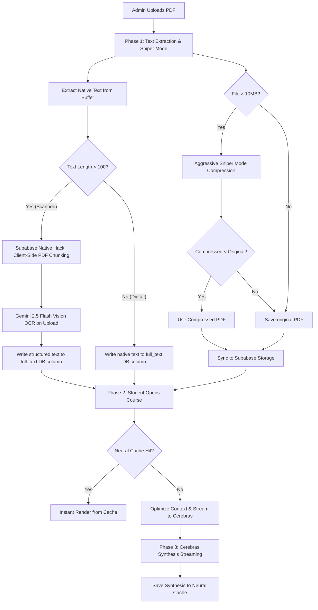

# 🧬 USTED Scholar: Advanced Course Upload & AI Synthesis Pipeline

This document provides a comprehensive technical walkthrough of the end-to-end engineering pipeline for course material uploads, aggressive file optimization, parallel optical text extraction, and ultra-fast AI synthesis currently powering the **USTED Scholar** platform.



---

## 📂 PHASE 1: Admin Upload & Pre-Processing (Sniper Mode & "Supabase Native" OCR Hack)
When an administrator uploads a new course material PDF in the `AdminScreen`, the system immediately initiates a multi-stage validation, extraction, and compression pipeline designed to circumvent network limits and database constraints.

### 1. Pure Text Extraction (Pre-Sniper)
* **Goal**: Capture a perfect digital backup of the text **before** any visual compression alters text readability.
* **Workflow**: The file is read as an `ArrayBuffer` directly in the browser. It runs through `extractTextFromPdf` to extract all selectable academic characters.

### 2. ⚡ The "Supabase Native" Hack (Gemini 2.5 Flash OCR on Upload)
Previously, visual OCR fallbacks were executed on the student side in real-time when requesting a synthesis. This introduced latency, high API costs, and a sluggish user experience for scanned lecture notes.

* **The Solution**: The Gemini Vision API call has been moved to **Phase 1 (Admin Upload)**.
* **The Process**:
  1. If `extractTextFromPdf` (skipping local heavy OCR) returns **less than 100 characters**, the system flags the PDF as scanned/non-readable.
  2. The browser automatically chunks the first **5 pages** of the scanned PDF into canvas frames at a fast scale of `1.0` to maximize speed while maintaining perfect readability.
  3. These canvas frames are converted into highly optimized JPEG Base64 streams and passed in a single batch to the **Supabase Edge Function AI Gateway**.
  4. The gateway invokes **Gemini 2.5 Flash** with the directive: *"Extract all academic text from these pages. Focus on headings, key concepts, formulas, and structure. No fluff."*
  5. The extracted plain-text is saved directly into the `full_text` column.
* **Why it solves the latency issue**: Extracted academic text is permanently stored in the `full_text` column right during upload. When students open a course or request a study guide, **the system bypasses all image processing, PDF downloads, and OCR in real-time**—it instantly pulls the pre-saved text and streams it straight to the **Cerebras Llama 3.1 8B** model!

### 3. Sniper Mode (Smart Optimizer)
For large, unoptimized slides or scanned PDFs (exceeding **10MB**), the system automatically activates **Sniper Mode** to shrink files below the Supabase Free Tier limit of **50MB**.

* **Resolution Scaling**: Downscales pages to a factor of `1.2` (down from `1.5`) inside an HTML canvas.
* **Aggressive Quality Compression**: Canvas frames are serialized to JPEG Data URLs at a reduced quality of `0.4` (previously `0.5`) to aggressively slice away digital bloat.
* **Reassembly**: Uses `jsPDF` to compile the optimized JPEGs back into a high-density, web-ready PDF binary stream.
* **The Safety Check**:
  ```typescript
  // CRITICAL FIX: Only use compressed if it's actually smaller!
  if (compressedBlob.size < file.size) {
    fileToUpload = compressedBlob;
  } else {
    fileToUpload = file; // Abort compression to prevent unnecessary bloating
  }
  ```

### 4. Supabase Storage Sync
* **Storage Bucket**: The optimized PDF binary is uploaded to `course-materials` under a folder path structured by its meta-tag: `L[Level]_S[Semester]/[random_hash].pdf`.
* **Database Entry**: Inserts a new record in the `courses` table storing the `name`, `meta_tag` (e.g., `L100_S1`), multi-program classification array `programmes`, unique `file_id`, `storage_path`, and the complete pre-extracted `full_text` (resolved via native extraction or Gemini 2.5 Flash).

---

## 👁️ PHASE 2: Student-Side Text Extraction & Local Fallbacks
When a student requests a course synthesis in the `HubScreen`, the system resolves the text through a cached and tiered local pipeline. If the document was uploaded using the **Supabase Native Hack**, these steps are **entirely bypassed**, resulting in instantaneous streaming!

### 1. Smart OCR Auto-Detection
* **Goal**: Skip heavy OCR engines for digital-native files.
* **Mechanism**: Samples the first `5` pages of the PDF. If the sum of native text exceeds **30 characters**, the PDF is flagged as selectable/digital. The heavy OCR parser is completely skipped, speeding up load times by 90%.

### 2. Strategic OCR Page Selection (Speed Multiplier)
Running Tesseract OCR on a massive `150+` page document wastes processing cycles and crashes mobile browsers. If the file is scanned/non-selectable, the system restricts OCR scanning to the most academically dense zones (capped at **30 pages**):
1. **The First 15 Pages**: syllabus details, course outlines, introductory definitions.
2. **The Concluding 5 Pages**: summary paragraphs, study questions, references.
3. **10 Spaced Pages**: key middle body samples selected evenly through the document.

### 3. Parallel Tesseract.js Engine
* Spawns exactly **3 parallel Tesseract.js workers**. This is the absolute sweet spot to maximize multi-threading on dual-core student mobile devices without causing thermal-throttling or browser freezes.
* **Fidelity Acceleration**: Renders canvas pages at a scale of `0.8` instead of `1.5`. This slashes the pixel rendering count by **4x**, driving a **400% boost in OCR speed** with zero loss in recognition accuracy.

---

## 🧠 PHASE 3: The Synthesis Engine (Cerebras Prompt Architecture)
Once the plain text is resolved, it enters the **Cerebras Synthesis Engine** to construct a highly personalized, high-retention study guide.

### 1. Context Payload Optimization
* **Cerebras Constraints**: Models like Llama 3.1 8B support colossal input context windows up to 131,072 tokens (approx 400k+ characters).
* **Optimization**: To maintain light payloads, optimize network calls, and stay safely inside quota guidelines, the text payload is truncated at a generous **120,000 characters** (approx. 30,000 words).
  ```typescript
  const MAX_CHAR_LIMIT = 120000;
  let optimizedText = textToProcess;
  if (textToProcess.length > MAX_CHAR_LIMIT) {
    optimizedText = textToProcess.substring(0, MAX_CHAR_LIMIT) + 
      "\n\n... [Content truncated for AI token window optimization. Ask the AI assistant on the right to explain specific sections in deeper detail!] ...";
  }
  ```
  This preserves the main body text while informing the user that they can query details via the side chat interface.

### 2. Neural Caching
* **Instant Hits**: Prior to requesting the AI gateway, the system queries the `synthesis` column in the database.
* **Response Time**: If a cache hit is found, it renders in **0ms** instead of generating a new request.
* **Cache Re-sync**: Students can click **"Regenerate Neural Link"** to force-bypass the cache and re-synthesize.

### 3. Cerebras Llama 3.1 8B Synthesis
* **Latency**: Employs Cerebras Cloud SDK via the AI Gateway, delivering lightning-fast streaming speeds (over **100+ tokens per second**).
* **UI Feedback**: Updates state stages sequentially: `Checking neural cache...` ➔ `Secure AI Synthesis...` ➔ `Writing...` in real-time.
* **Saving**: On completion, the system automatically caches the generated Markdown guide back to Supabase.

### 4. Custom Anti-AI Persona & Ghanaian Context
The synthesis is dictated by a hyper-focused persona constraint designed to eliminate generic robot fluff:
* **The Banned Buzzwords List**: The model is forbidden from using repetitive AI words:
  > *delve, pivotal, comprehensive, transformative, multi-faceted, underscores*
* **Zero-Intro Policy**: Starts directly with the first heading (e.g. `# Network Fundamentals`). No intros like *"Here is a synthesis of..."*, no apologies, and no conversational preambles.
* **Aesthetic Formatting**: Uses bolding strictly for key terms, short and scannable bullet points, and clean lists.
* **Ghanaian Academic Tone**: Emulates a senior student explaining concepts to a junior over coffee, incorporating local academic context like *"Mid-sem"* and *"End-of-sem"*.

---

## ⚡ PHASE 4: Synthesis-Adjacent Generative Workflows
Once a document has its `full_text` or `synthesis` indexed, USTED Scholar unlocks three highly interactive workflows:

| Feature | Primary AI Tool / Provider | Model | Description |
| :--- | :--- | :--- | :--- |
| **Interactive Document Chat** | **Groq** | `llama-3.3-70b-versatile` | Streams low-latency responses using the loaded context and a specialized mentor persona. |
| **Interactive Quiz Generator** | **Gemini** | `gemini-2.5-flash-lite` | Generates 5 academic multiple-choice questions in structured JSON format with explanations. |
| **Study Flashcard Generator** | **Gemini** | `gemini-2.5-flash-lite` | Outputs 15 customized flashcards (front/back questions and answers) in raw JSON. |
| **Smart Thread Title Generator** | **Cerebras** | `llama3.1-8b` | Examines the initial chat input and returns a short, punchy 3-5 word thread title (no quotes). |

---

> [!NOTE]
> All AI requests routing to **Cerebras**, **Groq**, and **Gemini** are processed securely through the central `https://wruymvxttqlxgcvwfcop.supabase.co/functions/v1/ai-gateway` edge function, leveraging rotating fallback configurations.
