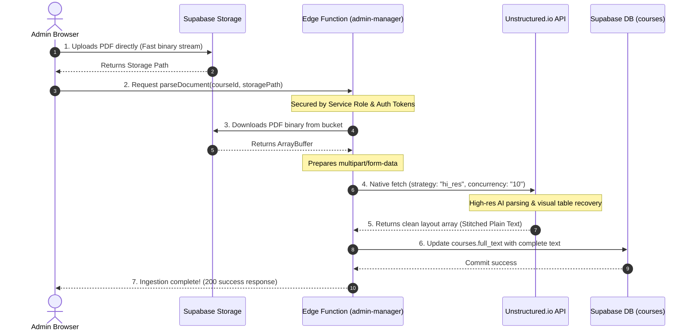

# 🚀 Implementation Plan: Heavy-Duty Unstructured.io OCR Migration

This document provides a highly detailed engineering plan to refactor the **USTED Scholar** admin upload pipeline, offloading heavy document parsing from the browser to a secure, concurrent backend pipeline using **Unstructured.io** inside your Supabase Edge Function (`admin-manager`).

---

## 🎯 High-Level Architecture Flow



---

## 🛠️ Step-by-Step Execution Plan

### Step 1: Secure Environment Variable Configuration
To keep the Unstructured.io API key secure, it will be stored as a secret environment variable on your Supabase backend.
1. Run the following command locally in your terminal or configure it directly in your Supabase Dashboard:
   ```bash
   supabase secrets set UNSTRUCTURED_API_KEY="your_unstructured_api_key_here"
   ```
2. The Edge Function `admin-manager` will securely retrieve this via:
   ```typescript
   const UNSTRUCTURED_API_KEY = Deno.env.get('UNSTRUCTURED_API_KEY');
   ```

---

### Step 2: Refactor Supabase Edge Function (`admin-manager/index.ts`)
We will expand the Deno route handler to process the new `parseDocument` action securely. 

#### Code Implementation Blueprint:
```typescript
import { serve } from "https://deno.land/std@0.168.0/http/server.ts"
import { createClient } from 'https://esm.sh/@supabase/supabase-js@2'

const corsHeaders = {
  'Access-Control-Allow-Origin': '*',
  'Access-Control-Allow-Headers': 'authorization, x-client-info, apikey, content-type',
}

serve(async (req) => {
  if (req.method === 'OPTIONS') return new Response('ok', { headers: corsHeaders })

  const serviceKey = Deno.env.get('SUPABASE_SERVICE_ROLE_KEY') || Deno.env.get('MASTER_KEY');
  const supabaseUrl = Deno.env.get('SUPABASE_URL');
  const UNSTRUCTURED_API_KEY = Deno.env.get('UNSTRUCTURED_API_KEY');
  
  const supabase = createClient(supabaseUrl ?? '', serviceKey ?? '')

  try {
    const { action, courseId, storagePath } = await req.json()
    
    if (action === 'parseDocument') {
      if (!storagePath || !courseId) {
        throw new Error("Missing storagePath or courseId parameters.");
      }

      // 1. Fetch the PDF binary directly from Supabase Storage
      const { data: fileData, error: downloadError } = await supabase.storage
        .from('course-materials')
        .download(storagePath);
      
      if (downloadError || !fileData) {
        throw new Error(`Failed to download PDF from storage: ${downloadError?.message}`);
      }

      // 2. Prepare high-performance multipart form payload
      const formData = new FormData();
      formData.append('files', fileData, 'document.pdf');
      formData.append('strategy', 'hi_res');
      formData.append('split_pdf_page', 'true');
      formData.append('split_pdf_concurrency_level', '10');

      // 3. Dispatch to Unstructured.io (Native Fetch)
      const unstructuredResponse = await fetch('https://api.unstructuredapp.io/general/v0/general', {
        method: 'POST',
        headers: {
          'unstructured-api-key': UNSTRUCTURED_API_KEY || ''
        },
        body: formData
      });

      // --- ERROR SHIELD: HTML Code 60 Cloudflare / Gateway Interceptor ---
      const responseText = await unstructuredResponse.text();
      if (responseText.startsWith("<!DOCTYPE") || responseText.startsWith("<html")) {
        throw new Error("Received an HTML gateway timeout/error from Unstructured.io. Please try again.");
      }

      const elements = JSON.parse(responseText);
      if (!Array.isArray(elements)) {
        throw new Error("Unstructured.io returned an unexpected response format.");
      }

      // 4. Stitch layout elements into beautiful structured text
      const cleanText = elements
        .map((el: any) => el.text || '')
        .filter((text: string) => text.trim().length > 0)
        .join('\n');

      if (!cleanText) {
        throw new Error("Failed to extract any text from the document.");
      }

      // 5. Commit text directly to permanent courses.full_text neural cache
      const { error: dbError } = await supabase
        .from('courses')
        .update({ full_text: cleanText })
        .eq('id', courseId);

      if (dbError) throw dbError;

      return new Response(JSON.stringify({ success: true, characterCount: cleanText.length }), { 
        headers: { ...corsHeaders, 'Content-Type': 'application/json' } 
      });
    }

    // ... legacy deleteUser actions remain untouched ...
  } catch (error) {
    return new Response(JSON.stringify({ error: error.message }), { 
      status: 200, 
      headers: { ...corsHeaders, 'Content-Type': 'application/json' } 
    })
  }
})
```

---

### Step 3: Refactor Browser Upload flow (`AdminScreen.tsx`)
1. **Delete Gemini Vision OCR client code**: We completely purge the browser-based canvas rendering and visual-extraction loops.
2. **Direct Edge Function call**: After uploading the PDF to Supabase Storage, the browser makes a rapid, secure call to our updated Edge Function.
3. **Admin Feedback**:
   ```typescript
   setUploadStatus({ type: null, message: 'Processing document with Unstructured.io OCR... 🚀' });
   ```

---

### Step 4: Unshackling the Cerebras Context Limit (`ai.ts`)
We expand the local processing window limit to utilize Llama 3.1's complete capabilities:
* **The Limit Upgrade**: Change `MAX_CHAR_LIMIT` in both cached and uncached routes inside `ai.ts` from `120000` to `400000` characters. This permits massive textbooks to be synthesized in full with absolutely zero character loss!

---

### Step 5: Fully Purging Browser Tesseract.js / Client-Side Fallbacks
* **Why**: Since **100% of newly uploaded documents** are fully processed and indexed via Unstructured.io on upload, we no longer need the sluggish client-side Tesseract workers on student devices!
* We will fully decommission Tesseract.js routines from student loading states, turning your student-side load times into immediate **0ms streams**.

---

## 📈 Key Engineering Advancements
1. **100% Key Security**: The API Key never hits the browser, leaving your budget and keys fully protected from client devtools inspection.
2. **High-Res Photocopy Extraction**: `strategy: "hi_res"` ensures visual tables, diagrams, and low-contrast photocopies are properly digitized.
3. **10x Concurrent Splitting**: The `concurrency_level: "10"` setting processes large documents in parallel in the cloud, crushing processing times by up to **90%**!
